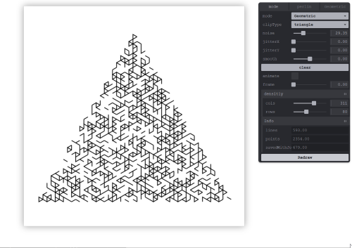

# Plotter Playground

The purpose of this project is to streamline and document the process of converting vector line art to be printed on a modded Ender 3 printer.

## Artwork generation



this repo contains a app that can be used to generate SVGs from sets of points using the brilliant [canvas-sketch](https://github.com/mattdesl/canvas-sketch) and various resources online.

some code taken from resouces online, with some added extras.

## running

- `yarn install`
- `yarn start`
- `ctrl-s` in browser to export.

## Printing artwork.

- generate svg line to svg with this tool
- **change svg width and height units to mm**
- convert to gcode with [svg2gcode](https://sameer.github.io/svg2gcode/#close) / [github](https://github.com/sameer/svg2gcode). see below for settings, adjust the feedrate based on image / amount of detail. _Have previously tried InkScape for this but produces too many artifacts with more compicated SVGs. with built in gcode tools_
- print! I have been uploading to octoprint but this should work with sd card.
- the printer will auto home, move to the front left corner of your build surface and wait for a user input, load the pen now and resume!

## Resources

### Ender 3 Plotter attachment

[see supporting docs](./supporting/ender-3-plotter/readme.md)

### Svg2gcode settings

```json
{
  "conversion": {
    "tolerance": 0.002,
    "feedrate": 1500.0, //change as needed
    "dpi": 72.0,
    "origin": [106.0, 74.0] // offset for a A4 sqaureish on ender3 build plate.
  },
  "machine": {
    "supported_functionality": {
      "circular_interpolation": true //please check, ender 3 with latest marlin supports.
    },
    "tool_on_sequence": "G0 Z1.5", //move Z towards paper
    "tool_off_sequence": "G0 Z5", //retract Z
    "begin_sequence": "G28 ; Home all axes\nG00 X77 Y39 Z1.3\nM0", //home, move to corner, wait for input (insert pen)
    "end_sequence": "M5\nG90 ;Absolute positioning\nG1 X0 Y220.0 ;Present print\nM2" //end and present print.
  },
  "postprocess": {
    "origin": [106.0, 74.0]
  }
}
```

## todo:

- intergrate svg2gcode into project? remove manual use of hosted version.
